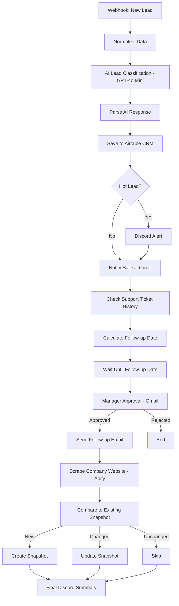

# Lead Intelligence Pipeline

An end-to-end lead management system built in n8n — from a raw customer 
inquiry to AI-based classification, CRM storage, manager-approved outreach, 
and automated company research. Built to replace manual lead triage with a 
single automated pipeline.

## What it does

- Captures incoming leads via webhook and classifies them (Hot/Warm/Cold) 
  using GPT-4o Mini
- Stores every lead in an Airtable CRM, complete with urgency and AI notes
- Alerts the sales team instantly on hot leads via Discord, and by email on every lead
- Looks up a customer's support ticket history automatically for context
- Schedules a follow-up and **requires manager approval before any customer 
  is contacted** — no fully autonomous outreach
- Scrapes the customer's company website and tracks changes over time, 
  without creating duplicate records on repeat runs

## Architecture

## Why it's built this way

- **Email as the CRM key, not name** — prevents two different people with 
  the same name from being merged into one record.
- **Manager approval before customer contact** — the AI can classify and 
  recommend, but never emails a customer without a human sign-off. This is 
  a deliberate boundary, not a missing feature.
- **Snapshot comparison instead of blind overwrite** — company data only 
  updates when something actually changed, so the CRM doesn't fill up with 
  no-op updates.

## Tech stack
n8n, OpenAI GPT-4o Mini, Airtable, Gmail, Apify (Cheerio Scraper), Discord

## Files
- `workflow/lead-intelligence-pipeline.json` — importable n8n workflow
- `sample-data/sample-leads.csv` — fake data for testing
- `docs/design-decisions.md` — the reasoning behind key choices

## Note on data
All sample data is fake/generated. No real client data is included.

## What I'd add next
A RAG-based FAQ layer so the agent can answer policy questions directly 
from company documents, and a lightweight dashboard for reviewing pending 
approvals without going into Gmail.
